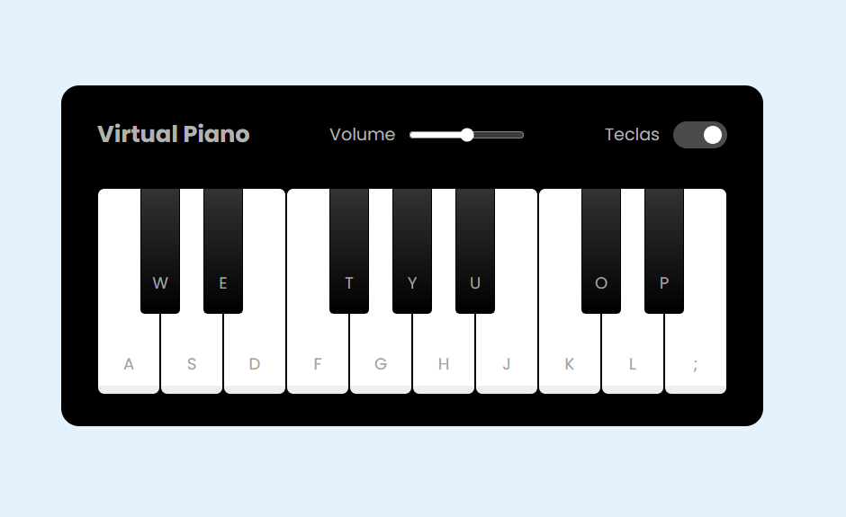

# 🎹 Piano Web

Um piano interativo feito com HTML, CSS e JavaScript. Toca e diverte-te\!

## 🚀 Demonstração

[https://jcquadros.github.io/piano/](https://jcquadros.github.io/piano/)

## 📸 Imagem

## 🛠️ Como Usar (Dev)

1.  `git clone https://github.com/jcquadros/piano.git`
2.  `cd piano`
3.  Abre `index.html` no teu navegador.

